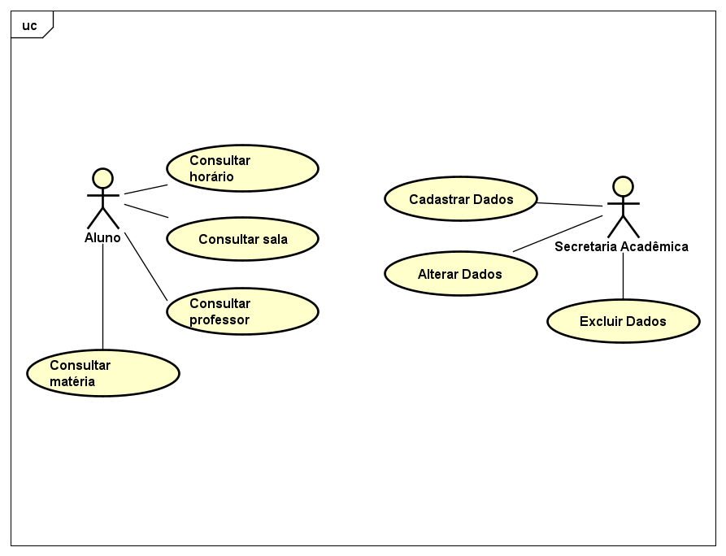
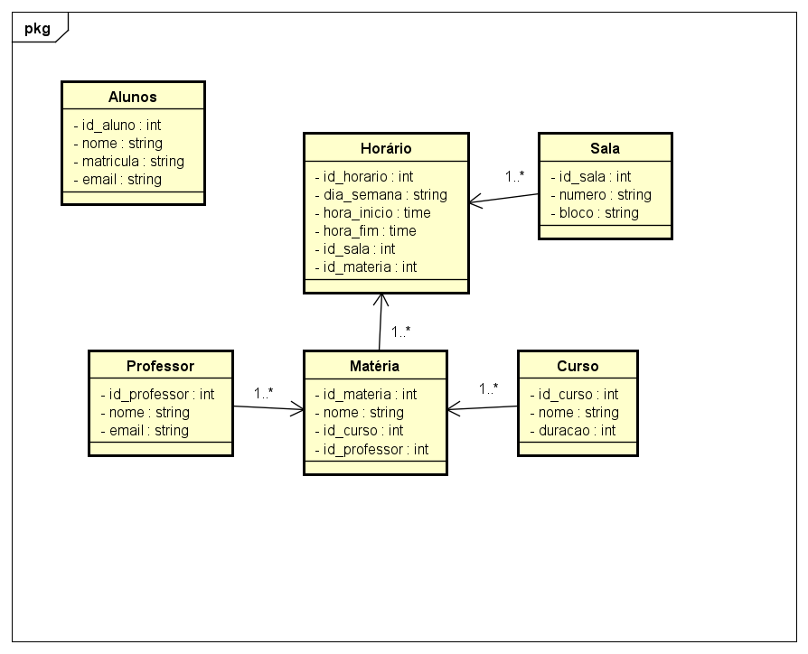
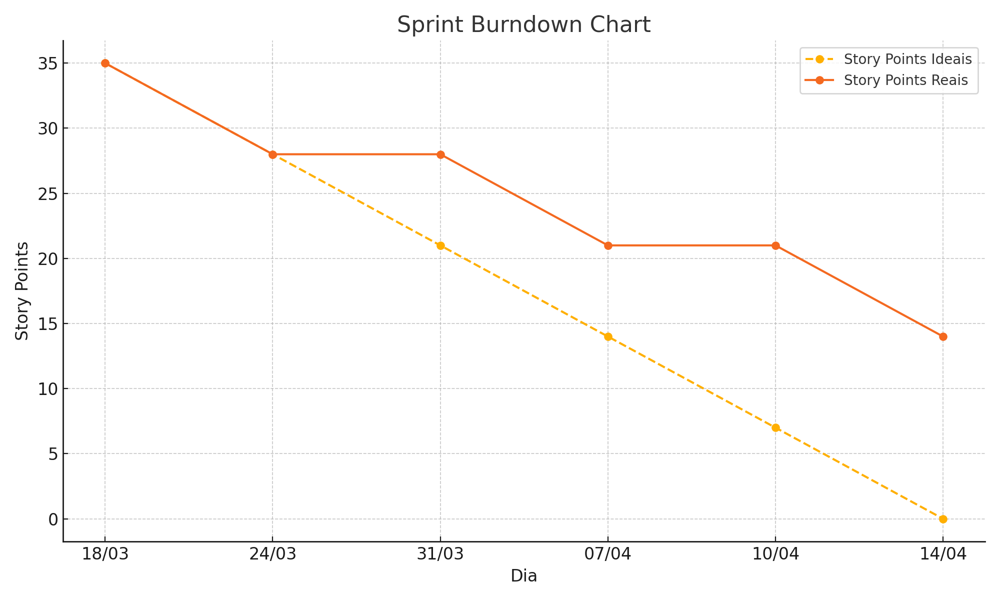

<h1 align="center">Fatec Jacareí- DSM 1º SEMESTRE</h1>

# 
Equipe 💻: TechCastle 

 

# SOBRE O PROJETO 
## 
 Aplicação Web para visualização de horários de aula e ambientes.

## SPRINTS

| Sprint | Link        | Início      | Entrega     | Status |
|--------|-------------|-------------|-------------|--------|
| 01     | [Sprint 01](#sprint-1) | 24/03/2025  | 15/04/2025  |       |
| 02     | [Sprint 02](#sprint-2) | 16/04/2025  | 13/05/2025  |       |
| 03     | [Sprint 03](#sprint-3) | 14/05/2025  | 11/06/2025  |       |

 

 

## :page_with_curl: Product Backlog

### REQUISITOS FUNCIONAIS

| REQUISITO FUNCIONAL_ID | REQUISITOS                                                                                                 | SPRINTS |
|------------------------|------------------------------------------------------------------------------------------------------------|---------|
| RF - 1                 | Fazer a ingestão de dados no sistema a partir de uma fonte tal como um arquivo CSV                         | #02     |
| RF - 2                 | (opcional) Fazer o gerenciamento dos dados do sistema (CRUD) através da interface da aplicação, permitindo que a secretaria acadêmica/coordenação altere os dados por meio de uma tela da aplicação                                                                                                                             | #03     |
| RF - 3                 | Garantir que o cadastro ou a ingestão de dados satisfaça as regras básicas de alocação da faculdade (ex.: duas turmas diferentes não podem ser alocadas na mesma sala, e um professor não pode ter duas turmas no mesmo horário)                                                                                                         | #02     |
| RF - 4                 | Permitir que o sistema exporte relatórios/mapas de ambientes e horários em formato PDF                     | #03 |
| RF - 5                 | Permitir consultas no sistema (ex.: por turma, turno, professor, data) para apoiar a gestão da faculdade   | #02     |

### REQUISITOS NÃO FUNCIONAIS

| REQUISITO NÃO_FUNCIONAL_ID | REQUISITOS                                                                                          | SPRINTS     |
|----------------------------|-----------------------------------------------------------------------------------------------------|-------------|
| RNF - 1                    | Requisito de interface: exibir um mapa de salas com a opção interativa de clicar e visualizar a situação do ambiente (ex. aulas alocadas ao longo dos turnos do dia)   | #01   #02   |
| RNF - 2                    | Garantir que o sistema seja responsivo, mantendo um layout consistente em dispositivos móveis e preservando a arquitetura de informação da interface    | #01       |

 

## :page_with_curl: USER STORIES

| ID REFERÊNCIA | User Case | Remetente                  | Instrução                                                                                                              | Finalidade                                                                                              |
| ------------- | --------- | -------------------------- | ---------------------------------------------------------------------------------------------------------------------- | ------------------------------------------------------------------------------------------------------- |
| RNF - 1       | UC1       | Aluno                      | Os alunos devem poder visualizar seus horários de aula organizados por dia da semana                                   | Permitir que os alunos tenham acesso rápido e organizado aos seus horários, evitando confusão e atrasos |
| RNF - 1       | UC2       | Aluno                      | Deve haver uma interface para consulta dos professores por nome                                                        | Facilitar o contato entre alunos e professores, permitindo que tirem dúvidas e organizem atendimentos   |
| RNF - 1       | UC3       | Aluno                      | Os alunos devem poder visualizar um mapa interativo das salas de aula                                                  | Ajudar os alunos a localizar facilmente suas salas, reduzindo atrasos e confusão no campus              |
| RF - 2, RF - 3, RF -5 | UC4       | Secretaria Acadêmica       | A Secretaria Acadêmica deve poder cadastrar, editar e remover professores                                              | Manter os registros de professores sempre atualizados para refletir mudanças na equipe acadêmica        |
| RF - 2, RF - 3, RF -5 | UC5       | Secretaria Acadêmica       | A Secretaria Acadêmica deve poder cadastrar, editar e remover disciplinas                                              | Garantir que o sistema esteja atualizado com a grade curricular vigente                                 |
| RF - 3       | UC6       | Secretaria Acadêmica       | O sistema deve permitir a associação de professores às disciplinas                                                     | Assegurar que os alunos possam visualizar quem ministra cada disciplina                                 |                                    
| RNF - 1       | UC7       | Aluno/Secretaria Acadêmica | O sistema deve ter uma interface amigável                                                                              | Agilizar a navegação e a localização de informações relevantes dentro da plataforma                     |
| RF - 1       | UC8       | Secretaria Acadêmica       | Deve haver um sistema de autenticação para que apenas usuários autorizados possam acessar determinadas funcionalidades | Garantir a segurança e integridade das informações acadêmicas                                           |
| RNF - 2       | UC9       | Aluno/Secretaria Acadêmica | O sistema deve ser responsivo para funcionar em dispositivos móveis                                                    | Assegurar que os alunos e a secretaria acadêmica possam acessar as informações de qualquer dispositivo  |
| RF - 4       | UC10      | Aluno/Secretaria Acadêmica | O sistema deve permitir o download dos horários das aulas e dos mapas de sala em formato PDF                           | Facilitar o acesso offline e a impressão das informações pelos alunos e funcionários                    |

 

## 📘 Diagrama de Casos de Uso

 

---

## 📗 Diagrama de Classes

 

 

## :page_with_curl: EQUIPE

 

| NOME               | FUNÇÃO        | GITHUB                               |
|--------------------|---------------|--------------------------------------|
| Bruno Berval       | Project Owner | [BrunoBerval](https://github.com/BrunoBerval) |
| Fernanda Vilela    | Scrum Master  | [fernanda-vilela](https://github.com/fernanda-vilela)      |
| Bruna Rodrigues    | Developer     | [brunagomess26](https://github.com/brunagomess26) |
| Camila Aparecida   | Developer     | [camilaapfqsantos](https://github.com/camilaapfqsantos) |
| Nicolas Kauê       | Developer     | [nickdsm24](https://github.com/nickdsm24) |
| Pedro Enrique      | Developer     | [lJesusl-f](https://github.com/lJesusl-f) |
| Ryan Pedro         | Developer     | [RockLeeVSGaaraLinkinPark](https://github.com/RockLeeVSGaaraLinkinPark)|
| Suelen Castro      | Developer     | [gatinhosdeluvinhas](https://github.com/gatinhosdeluvinhas)|

 

## LINGUAGENS E FERRAMENTAS
 

 
   
   
   
   
   
   
  
   

 

 
## :page_with_curl: SPRINT 1 

Na Primeira Sprint priorizamos para a criação dos modelos das telas do programa em Figma com protótipos das funcionalidades. Criamos as telas tanto para utilização em desktop quanto para mobile, visando a compatibilidade com ambos os dispositivos. Iniciamos o desenvolvimentos das primeiras telas em HTML/CSS para dar uma amostra de como será o resultado final, e também a criação do banco de dados SQL para o armazenamento das informações do sistema. 

 

### • Sprint Backlog
 

| ID REFERENCIA |Pioridade (Scrum Poker Planning) | REQUISITO DA SPRINT| Responsável |TAREFA INICIADA | TAREFA CONCLUIDA | 
|---------------|--------------------|---------------|-----------------|-----------------|------------------|
|  RNF - 2    | 2 |Definir elementos das páginas para criar os protótipos iniciais utilizando diagrama de casos de uso |Bruna e Pedro | ✔  |✔  |
|  RNF - 1    | 6 |Elaboração dos protóripos das telas no Figma para ambiente desktop e mobile, verificando a navegabilidade do site   |Bruna, Suelen e Pedro | ✔  |✔  |
|  RNF - 2 | 2 |Definir a harmonia visual do site, escolhendo contrastes e paleta de cores com a equipe|Bruna, Suelen e Pedro  | ✔  |✔  |
|  RF - 1/ RF - 5    | 1 |Levantamento das informações referentes aos horários de aulas e disposição das salas da Fatec|Camila, Ryan e Nicolas|  ✔  |✔  |
|  RNF - 2    | 2 |Realizar o prototipo da primeira tela em html |Bruno | ✔  |✔  |
|  RNF - 2    | 4 |Organizar a documentação no github |Fernanda | ✔  |✔  |
|  RF - 1/ RF - 3    | 6 |Coleta de informações em CSV para organização e criação das primeiras cláusulas em .sql  |Camila e Nicolas   | ✔  |✔  |
|  RNF - 2    | 2 |Desenvolver a primeira versão da página de cadastro de matérias em HTML, estilizando em CSS de acordo com o design do Figma e colocar as funcionalidades em JavaScript, quando necessário. |Bruna |  ✔  |  |
|  RNF - 2    | 2 |Desenvolver a primeira versão da página de cadastro de professores em HTML, estilizando em CSS de acordo com o design do Figma e colocar as funcionalidades em JavaScript, quando necessário. |Camila |  ✔  |  |
|  RNF - 2    | 2 |Desenvolver a primeira versão da página de hirários por turma em HTML, estilizando em CSS de acordo com o design do Figma e colocar as funcionalidades em JavaScript, quando necessário. |Ryan |  ✔  |  |
|  RNF - 2    | 2 |Desenvolver a primeira versão da página de lista de professores em HTML, estilizando em CSS de acordo com o design do Figma e colocar as funcionalidades em JavaScript, quando necessário. |Nicolas |  ✔  |  |
|  RNF - 2    | 2 |Desenvolver a primeira versão da página de lista de salas em HTML, estilizando em CSS de acordo com o design do Figma e colocar as funcionalidades em JavaScript, quando necessário. |Suelen e Pedro |  ✔  |  |
|  RNF - 2    | 2 |Desenvolver a primeira versão da página de login da secretaria em HTML, estilizando em CSS de acordo com o design do Figma e colocar as funcionalidades em JavaScript, quando necessário. |Fernanda |  ✔  |  |
|  RNF - 2    | 2 |Desenvolver a primeira versão da página da tela inicial da secretaria em HTML, estilizando em CSS de acordo com o design do Figma e colocar as funcionalidades em JavaScript, quando necessário. |Bruno |  ✔  |  |
 

 

### • Burndown Sprint 1
 

 

 

 

### • Sprint Retrospective 
 

**1. O que funcionou bem durante o sprint?**
 
Funcionou bem a divisão de tarefas que fizemos, atribuindo partes do projeto para cada um dos membros da equipe com prazos para o cumprimento das demandas e interação com todos para aprovação das idéias propostas.

**2. O que não funcionou tão bem durante o sprint?**
 
Ocorreu uma falha de comunicação em um determinado momento onde não ficou claro uma tarefa mas foi rapidamente corrigida.

**3. Quais ações podemos tomar para melhorar no próximo sprint?**
 
Praticar mais as reuniões e atualizações diárias das tarefas, evitando desencontros.
 

 
## :page_with_curl: SPRINT 2 

Na Segunda Sprint ... 

 

### • Sprint Backlog
 

| ID REFERENCIA | Prioridade (Scrum Poker Planning) | REQUISITO DA SPRINT                                                                                                     | Responsável | TAREFA INICIADA | TAREFA CONCLUIDA |
|---------------|-----------------------------------|--------------------------------------------------------------------------------------------------------------------------|-------------|------------------|-------------------|
| ---           | ---                               | Finalizar a primeira versão da tela que foi designada em HTML, estilizando em CSS de acordo com o design do Figma e colocar as funcionalidades em JavaScript, quando necessário. | Bruna       |                  |                   |
| ---           | ---                               | Finalizar a primeira versão da tela que foi designada em HTML, estilizando em CSS de acordo com o design do Figma e colocar as funcionalidades em JavaScript, quando necessário. | Suelen      |                  |                   |
| ---           | ---                               | Finalizar a primeira versão da tela que foi designada em HTML, estilizando em CSS de acordo com o design do Figma e colocar as funcionalidades em JavaScript, quando necessário. | Camila      |                  |                   |
| ---           | ---                               | Finalizar a primeira versão da tela que foi designada em HTML, estilizando em CSS de acordo com o design do Figma e colocar as funcionalidades em JavaScript, quando necessário. | Fernanda    |                  |                   |
| ---           | ---                               | Finalizar a primeira versão da tela que foi designada em HTML, estilizando em CSS de acordo com o design do Figma e colocar as funcionalidades em JavaScript, quando necessário. | Pedro       |                  |                   |
| ---           | ---                               | Finalizar a primeira versão da tela que foi designada em HTML, estilizando em CSS de acordo com o design do Figma e colocar as funcionalidades em JavaScript, quando necessário. | Ryan        |                  |                   |
| ---           | ---                               | Finalizar a primeira versão da tela que foi designada em HTML, estilizando em CSS de acordo com o design do Figma e colocar as funcionalidades em JavaScript, quando necessário. | Nicolas     |                  |                   |
| ---           | ---                               | Finalizar a primeira versão da tela que foi designada em HTML, estilizando em CSS de acordo com o design do Figma e colocar as funcionalidades em JavaScript, quando necessário. | Bruno       |                  |                   |
| ---           | ---                               | Estudo em grupo de JavaScript para nivelamento dos membros do grupo.                                                     | Todos       |                  |                   |
| ---           | ---                               | Estudo em grupo sobre node.js, express.js, e API para que todos do grupo possam atender aos requisitos da próxima Sprint | Todos       |                  |                   |

 

 

### • Burndown Sprint 2
 

...

 

### • Sprint Retrospective 
 

**1. O que funcionou bem durante o sprint?**
 
...

**2. O que não funcionou tão bem durante o sprint?**
 
...

**3. Quais ações podemos tomar para melhorar no próximo sprint?**
 
...
 