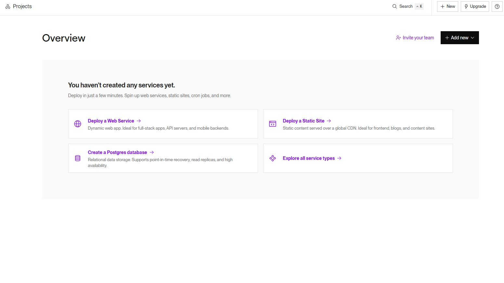
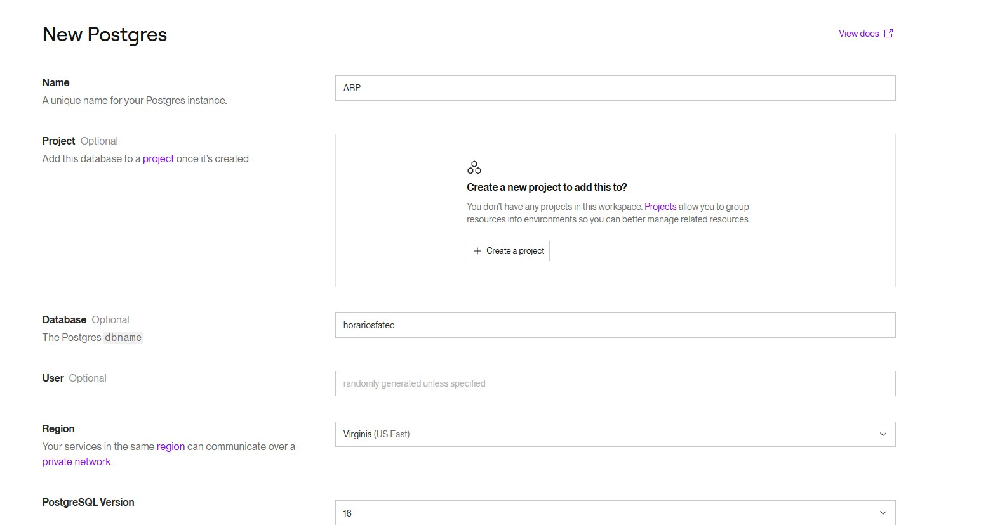
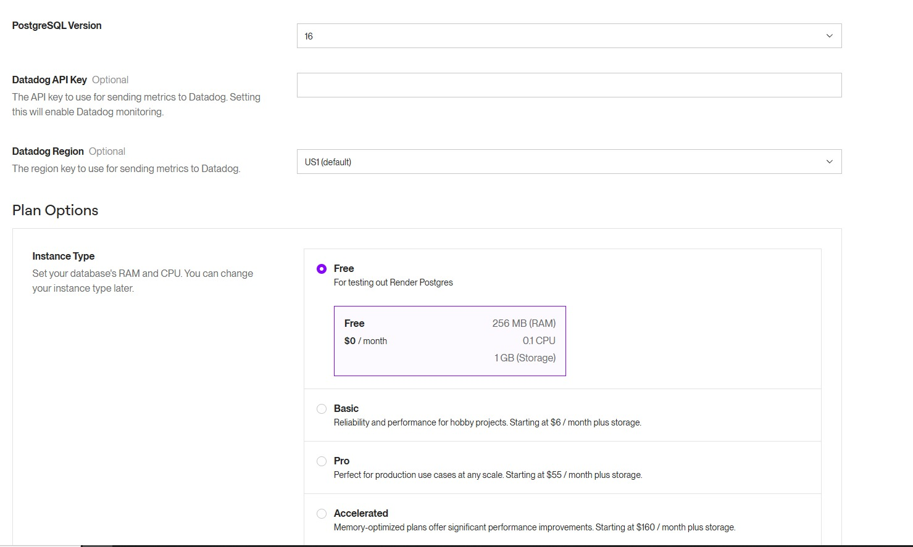

---

# 📚 Descrição do Banco de Dados

Esse repositório contém o esquema do banco de dados utilizado para gerenciar informações acadêmicas. Abaixo estão as tabelas detalhadas, com explicações para cada parte.

---

## 🗂️ Tabelas Principais

| **Tabela**      | **Descrição**                                                                 |
|-----------------|-------------------------------------------------------------------------------|
| **cursos**      | Armazena os cursos oferecidos pela instituição.                              |
| **turmas**      | Representa as turmas associadas a cursos e períodos.                        |
| **professores** | Contém os dados dos professores, como nome, email e foto.                    |
| **materias**    | Guarda as disciplinas (nome e carga horária).                               |
| **salas**       | Define os espaços físicos onde as aulas acontecem.                           |
| **horarios**    | Armazena os horários de início e fim para as aulas.                          |
| **aulas**       | Registra cada aula com suas relações: curso, turma, professor, etc.          |

---

Usamos o render para hospedar nosso banco de dados, aqui está um pequeno tutotial de como criar um BD no render:

Primeiramente, cria uma conta e clique na opçao "Create a Postgres database".

Preencha os dados para criar o banco.

Usamos a URL externa como variável de ambiente dentro de um arquivo .env na raiz para fazer a conexão com o banco e o sistema funcionar corretamente.
